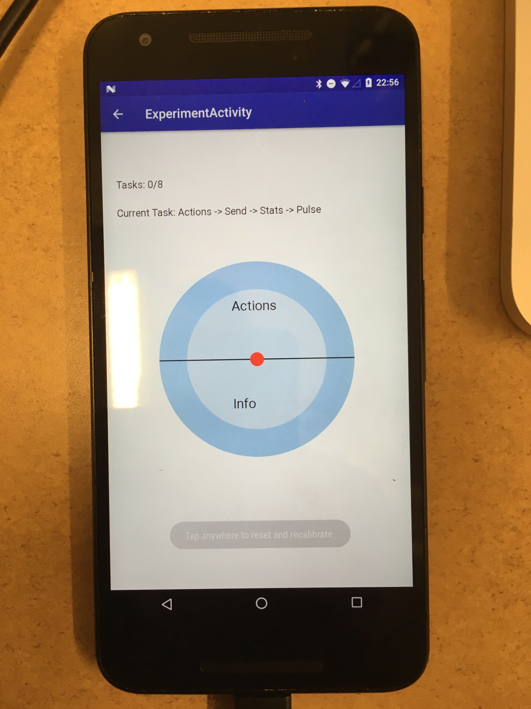

# Tilt-Menu Interaction
Menu selection experiment that presents a two-zone and a four-zone interface with a menu hierarchy and performance data logging functionality.

# Introduction
The application is based on the accelerometer+gyroscope (with Android's game rotation vector virtual sensor).

# Pre-requisites
* Android SDK 23 (Recommended 25)
* Android Build Tools 25.0.2
* Android Support Repo
* JSON Library (org.simple.json)

# Screenshots

# Setup and Run
* Using gradle build tools, you can either side-load the apk file into a phone from the `apk/` folder or import the project in Android Studio and build
* Configure the experiment by choosing the various options in the main screen and tap `START EXPERIMENT`
* The interface will then be presented with the menu to navigate to and the task number/order
* Once all the tasks are complete, the app will display a stats window with a summary of the performance data
* You can tap on the screen at any time to re-calibrate the sensors to use current orientation as a frame of reference

# Design
The code is meant to be highly modular and extensible for additional sensors. The Launcher `MainActivity.java` saves the configuration data (`ExperimentConfig.java`) to start the experiment. `ExperimentActivity.java` drives the experiment by doing the following operations (in order):
* registering as a listener to raw sensor values (`SensorListener.java`)
* piping it to the interpreter (`SensorInterpreter.java`)
* drawing and updating the view (`ExperimentView.java`), the menu items, the pointer, and task information
* listening for menu selection events (`ExperimentView.java`)
* logging data and information related to user accuracy and performance (`ExperimentStats.java`)
* handing off the the stats to a view object at the end of the experiment (`StatsActivity.java`)
